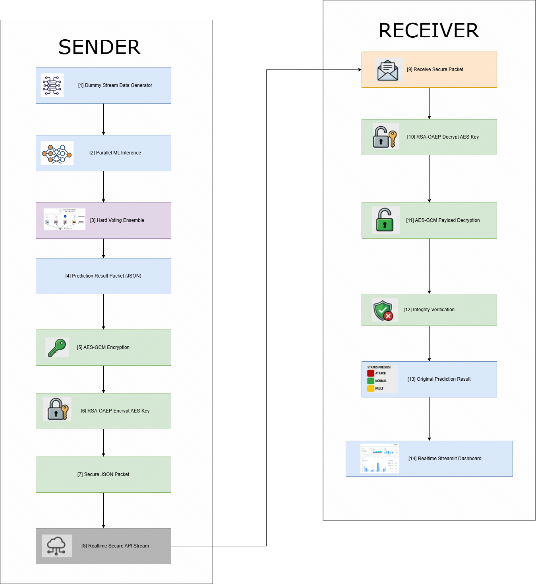

# Smart Grid Security Monitoring



**Kelompok 3 — Keamanan Data dan Aplikasinya**

Sistem monitoring keamanan smart grid secara realtime menggunakan Voting Classifier (Machine Learning) dan Hybrid Encryption (AES-256-GCM + RSA-2048-OAEP), divisualisasikan melalui dashboard Streamlit.

---

## Daftar Isi

1. [Gambaran Sistem](#gambaran-sistem)
2. [Alur Data](#alur-data)
3. [Struktur Folder](#struktur-folder)
4. [Setup Awal (Sekali Saja)](#setup-awal-sekali-saja)
5. [Menjalankan Sistem (Setiap Kali Demo)](#menjalankan-sistem-setiap-kali-demo)
6. [Checklist Verifikasi](#checklist-verifikasi)
7. [Mematikan Sistem](#mematikan-sistem)
8. [Mode Training Model (Opsional)](#mode-training-model-opsional)
9. [Konfigurasi Port & URL (.env)](#konfigurasi-port--url-env)
10. [Troubleshooting](#troubleshooting)
11. [Teknologi yang Digunakan](#teknologi-yang-digunakan)

---

## Gambaran Sistem

Sistem terdiri dari **4 komponen** yang berjalan di 4 terminal terpisah:

| # | Komponen | File | Port | Fungsi |
|---|---|---|---|---|
| 1 | **Data Generator** | `src/generator/data_generator.py` | `5055` | Menghasilkan data sensor smart grid secara realtime |
| 2 | **API Server** | `src/api/server.py` | `8001` | Menerima dan meneruskan data terenkripsi ke dashboard |
| 3 | **ML Pipeline** | `src/ml/ml.py` | — | Membaca data, prediksi, enkripsi, kirim ke server |
| 4 | **Dashboard** | `src/dashboard/dashboard.py` | `8501` | Menerima data, dekripsi, tampilkan visualisasi |

Komponen pendukung:

| Komponen | File | Fungsi |
|---|---|---|
| **Encryption Module** | `src/security/encrypt.py` | Library hybrid encryption (dipakai oleh ML Pipeline & Dashboard) |

---

## Alur Data

```
 ┌──────────────┐         ┌──────────────┐         ┌──────────────┐         ┌──────────────┐
 │  1. GENERATOR│  ──────>│  3. ML       │  ──────>│  2. API      │  ──────>│  4. DASHBOARD│
 │              │  SSE    │  PIPELINE    │  POST   │  SERVER      │  SSE    │              │
 │  Flask :5055 │  stream │              │  kirim  │  FastAPI     │  stream │  Streamlit   │
 │              │         │  Prediksi +  │  packet │  :8001       │  data   │  :8501       │
 │  Simulasi    │         │  Enkripsi    │         │              │         │  Visualisasi │
 │  data sensor │         │  AES+RSA     │         │  Relay +     │         │  + Dekripsi  │
 └──────────────┘         └──────────────┘         │  Broadcast   │         └──────────────┘
                                                    └──────────────┘
```

**Penjelasan alur secara berurutan:**

1. **Generator** membuat data sensor palsu (tegangan, arus, suhu, dll.) menggunakan Markov Chain + AR(1) — 10 data per detik untuk 50 perangkat (SGD-0001 hingga SGD-0050). Label asli (Normal/Attack/Fault) diteruskan ke ML Pipeline sebagai ground truth.
2. **ML Pipeline** membaca data dari Generator via SSE, lalu:
   - Melakukan prediksi menggunakan **Voting Classifier** (3 model: Decision Tree, Random Forest, Logistic Regression)
   - Dashboard menggunakan hasil **adaptive model** yang di-retrain secara periodik setiap 200 sampel dengan label asli dari generator, sehingga prediksi tetap sesuai dengan pola data terkini
   - Mengenkripsi hasil prediksi dengan **AES-256-GCM** (payload) + **RSA-2048-OAEP** (AES key)
   - Mengirim packet terenkripsi ke API Server via HTTP POST
3. **API Server** menyimpan packet di buffer dan mem-broadcast ke semua client yang terhubung via SSE
4. **Dashboard** menerima packet via SSE, mendekripsi dengan RSA + AES, lalu menampilkan grafik dan tabel realtime

> **Catatan:** Urutan start (1, 2, 3, 4) berbeda dengan urutan alur data (1, 3, 2, 4), karena API Server harus sudah siap sebelum ML Pipeline mengirim data ke sana.

---

## Struktur Folder

```
project-kda-kelompok3/
│
├── .env.example             -- Template konfigurasi (commit ke git)
├── .env                     -- Konfigurasi aktif (TIDAK masuk git)
├── load-env.ps1             -- Script load .env ke terminal PowerShell
├── README.md
├── requirements.txt
│
├── data/raw/                -- Dataset untuk training
│   ├── df_train.csv
│   └── df_test_lengkap.csv
│
├── hasil/
│   ├── keys/                -- RSA key pair (auto-generated, TIDAK masuk git)
│   ├── models/              -- Model ML yang sudah di-train (.pkl)
│   ├── metrics/             -- Metrik performa model
│   └── predictions/         -- Log hasil prediksi (auto-generated)
│
└── src/
    ├── generator/data_generator.py   -- Komponen 1: Data Generator
    ├── api/server.py                 -- Komponen 2: API Server
    ├── ml/ml.py                      -- Komponen 3: ML Pipeline
    ├── dashboard/dashboard.py        -- Komponen 4: Dashboard
    └── security/encrypt.py           -- Module enkripsi (library)
```

---

## Setup Awal (Sekali Saja)

> Langkah-langkah di bawah ini hanya perlu dilakukan **satu kali** saat pertama kali menyiapkan project. Jika sudah pernah setup, langsung ke bagian [Menjalankan Sistem](#menjalankan-sistem-setiap-kali-demo).

### Step 1 — Clone dan Masuk ke Folder Project

```bash
git clone <repository-url>
cd project-kda-kelompok3
```

### Step 2 — Buat dan Aktifkan Virtual Environment

Buat environment terisolasi agar dependency tidak bentrok dengan project lain:

```bash
python -m venv venv
```

Aktifkan virtual environment:

| Sistem | Perintah |
|---|---|
| Windows (PowerShell) | `.\venv\Scripts\Activate.ps1` |
| Windows (CMD) | `.\venv\Scripts\activate.bat` |
| macOS / Linux | `source venv/bin/activate` |

> Jika berhasil, prompt terminal akan berubah menampilkan `(venv)` di depan.

### Step 3 — Install Semua Dependency

```bash
pip install -r requirements.txt
pip install scikit-learn joblib flask flask-cors python-dotenv
```

Verifikasi semua terinstall:

```bash
python -c "import flask; import fastapi; import streamlit; import sklearn; import cryptography; import requests; print('Semua dependency OK!')"
```

> Jika muncul `ModuleNotFoundError`, install module yang kurang: `pip install <nama-module>`

### Step 4 — Buat File `.env`

File `.env` berisi konfigurasi port dan URL yang dipakai semua komponen.

```bash
copy .env.example .env
```

> macOS/Linux: `cp .env.example .env`

Isi default `.env` sudah bisa langsung dipakai tanpa perlu diubah:

```env
GENERATOR_PORT=5055
API_SERVER_PORT=8001
STREAM_URL=http://localhost:5055/data/realtime
PREDICTION_POST_URL=http://localhost:8001/prediction/receive
SSE_URL=http://localhost:8001/prediction/stream
PYTHONIOENCODING=utf-8
```

> **Mengapa pakai `.env`?** Sesuai prinsip mata kuliah Keamanan Data — konfigurasi sensitif (port, URL, credential) tidak boleh di-hardcode di source code. File `.env` tidak masuk ke git (sudah ada di `.gitignore`), sehingga setiap anggota tim bisa punya konfigurasi berbeda tanpa mengubah kode.

### Step 5 — Generate RSA Key Pair

RSA key dipakai untuk mengenkripsi AES key dalam hybrid encryption. Key hanya perlu di-generate **sekali**.

```bash
python src/security/encrypt.py
```

Output yang diharapkan:

```
[KEY] Generating RSA-2048 key pair...
[OK] Private key -> ...\hasil\keys\private_key.pem
[OK] Public key  -> ...\hasil\keys\public_key.pem
...
BERHASIL: payload asli == hasil dekripsi
BERHASIL: tampered packet ditolak -> InvalidTag
Semua test passed! encrypt.py siap dipakai.
```

> **Windows:** Jika muncul `UnicodeEncodeError`, tambahkan di depan:
> ```powershell
> $env:PYTHONIOENCODING='utf-8'; python src/security/encrypt.py
> ```

### Setup Selesai!

Setelah 5 langkah di atas selesai, project siap dijalankan kapan saja.

---

## Menjalankan Sistem (Setiap Kali Demo)

> **Yang dibutuhkan:** 4 terminal terpisah, semua dari folder root `project-kda-kelompok3/`

### Persiapan: Load `.env` di Setiap Terminal

**Sebelum menjalankan komponen apapun**, load dulu file `.env` di setiap terminal yang dibuka:

```powershell
. .\load-env.ps1
```

Output yang diharapkan:

```
[OK] 10 environment variables loaded dari .env

  GENERATOR_PORT     = 5055
  API_SERVER_PORT    = 8001
  STREAM_URL         = http://localhost:5055/data/realtime
  PREDICTION_POST_URL= http://localhost:8001/prediction/receive
  SSE_URL            = http://localhost:8001/prediction/stream
  PYTHONIOENCODING   = utf-8
```

> **macOS/Linux:** Gunakan `export $(grep -v '^#' .env | xargs)` sebagai pengganti.

Kalau sudah, lanjutkan ke langkah-langkah di bawah **secara berurutan**.

---

### Terminal 1 — Data Generator

**Apa fungsinya:** Menghasilkan data sensor smart grid secara realtime (10 baris/detik) menggunakan simulasi Markov Chain + AR(1) untuk 50 perangkat (SGD-0001 hingga SGD-0050). Setiap perangkat memiliki state independen (Normal, Attack, atau Fault) dengan transisi berbasis probabilitas.

**Perintah:**
```bash
python src/generator/data_generator.py --no-ngrok
```

**Tunggu sampai muncul output ini:**
```
Local URL : http://localhost:5055

Local Endpoints:
  http://localhost:5055/data/realtime  <- SSE stream

Ngrok dinonaktifkan (--no-ngrok). Berjalan lokal saja.
```

**Cara memastikan berhasil:** Buka browser, ketik `http://localhost:5055/status`, harus muncul JSON dengan `"status": "running"`.

> **JANGAN ditutup.** Biarkan terminal ini berjalan terus.

---

### Terminal 2 — API Server

**Apa fungsinya:** Menerima packet terenkripsi dari ML Pipeline dan mem-broadcast ke Dashboard via Server-Sent Events (SSE).

> **Kenapa API Server dijalankan sebelum ML Pipeline?** Karena ML Pipeline akan mengirim data ke API Server via HTTP POST. Kalau server belum jalan, data akan ditolak (connection refused).

**Perintah:**
```bash
python src/api/server.py
```

**Tunggu sampai muncul output ini:**
```
INFO:     Uvicorn running on http://0.0.0.0:8001
INFO:     Application startup complete.
```

**Cara memastikan berhasil:** Buka browser, ketik `http://localhost:8001/health`, harus muncul:
```json
{"status": "ok", "buffer_size": 0, "highest_seq": 0}
```

> **JANGAN ditutup.** Biarkan terminal ini berjalan terus.

---

### Terminal 3 — ML Pipeline

**Apa fungsinya:** Membaca data dari Generator, melakukan prediksi dengan Voting Classifier, mengenkripsi hasil, mengirim ke API Server.

**Prasyarat:** Terminal 1 (Generator) dan Terminal 2 (API Server) **harus sudah berjalan**.

**Perintah:**
```bash
python src/ml/ml.py
```

**Tunggu sampai muncul output ini:**
```
[PATH] BASE_DIR  : E:\project-kda-kelompok3

[0] Setup encryption keys...
[OK] Key management siap.

[1] Loading trained models...
    OK Loaded: trained_Decision_Tree.pkl
    OK Loaded: trained_Random_Forest.pkl
    OK Loaded: trained_Logistic_Regression.pkl

  SYSTEM RUNNING
  Stream URL  : http://localhost:5055/data/realtime
  Predict POST: http://localhost:8001/prediction/receive

[STREAM] Connected successfully!
[STREAM] Received data #1: device=SGD-xxxx
```

**Tanda berhasil:** Baris `[STREAM] Received data #N` terus bertambah, artinya data mengalir dan prediksi berjalan.

> **Catatan:** Akurasi mulai terlihat setelah sekitar 100 prediksi. Ground truth bersumber dari label asli generator yang diteruskan melalui SSE.
>
> Adaptive model akan di-retrain secara otomatis setiap 200 sampel menggunakan label asli generator, sehingga prediksi terus menyesuaikan dengan pola data terkini.

> **JANGAN ditutup.** Biarkan terminal ini berjalan terus.

---

### Terminal 4 — Dashboard

**Apa fungsinya:** Menampilkan visualisasi realtime — menerima data terenkripsi dari API Server, mendekripsi, lalu menampilkan grafik dan tabel.

**Prasyarat:** Terminal 2 (API Server) dan Terminal 3 (ML Pipeline) **harus sudah berjalan dan mengirim data**.

**Perintah:**
```bash
streamlit run src/dashboard/dashboard.py
```

**Tunggu sampai muncul output ini:**
```
  You can now view your Streamlit app in your browser.
  Local URL: http://localhost:8501
```

**Langkah selanjutnya:**
1. Buka browser, ketik `http://localhost:8501`
2. Klik tombol **Start** di sidebar kiri untuk mulai menerima data
3. Dashboard akan menampilkan:
   - Kartu metrik: Total Packet, Normal, Attack, Fault
   - Grafik sensor realtime (Tegangan, Arus, Suhu, Latency)
   - Tabel data 30 entri terakhir
   - Panel info enkripsi

---

## Checklist Verifikasi

Setelah 4 terminal berjalan, pastikan semua komponen terhubung:

| # | Yang Dicek | Cara Cek | Hasil Benar |
|---|---|---|---|
| 1 | Generator jalan | Browser, `http://localhost:5055/status` | `"status": "running"`, `total_rows` bertambah |
| 2 | API Server jalan | Browser, `http://localhost:8001/health` | `"status": "ok"` |
| 3 | Packet masuk server | Browser, `http://localhost:8001/buffer/peek` | Muncul data `encrypted_payload` |
| 4 | ML Pipeline kirim data | Lihat terminal 3 | `[STREAM] Received data #N` terus naik |
| 5 | Dashboard tampil | Browser, `http://localhost:8501` | Grafik dan tabel terupdate otomatis |
| 6 | SSE terhubung | Sidebar dashboard | Status: "SSE terhubung" |

Jika semua terverifikasi, **sistem siap demo!**

---

## Mematikan Sistem

Tekan `Ctrl+C` di setiap terminal, **urutan terbalik** (dashboard dulu, generator terakhir):

```
Terminal 4 (Dashboard)   -> Ctrl+C
Terminal 3 (ML Pipeline) -> Ctrl+C
Terminal 2 (API Server)  -> Ctrl+C
Terminal 1 (Generator)   -> Ctrl+C
```

---

## Mode Training Model (Opsional)

> **Model sudah tersimpan di `hasil/models/`.** Training ulang **tidak wajib** untuk demo. Lakukan hanya jika ingin melatih ulang dari awal.

```bash
python src/ml/ml.py --mode training
```

Proses ini akan:
1. Membaca `data/raw/df_train.csv` dan `data/raw/df_test_lengkap.csv`
2. Melatih 3 model (Decision Tree, Random Forest, Logistic Regression) dengan 5 iterasi cross-validation
3. Menyimpan file output:

| Output | Lokasi |
|---|---|
| Model (.pkl) | `hasil/models/` |
| Metrik performa | `hasil/metrics/model_summary.csv` |
| CV per iterasi | `hasil/metrics/iteration_metrics.csv` |
| Prediksi test set | `hasil/predictions/test_predictions.csv` |

---

## Konfigurasi Port & URL (.env)

Semua port dan URL dikonfigurasi lewat file `.env` di root project. **Tidak ada yang di-hardcode di source code.**

### Daftar Environment Variable

| Variable | Default | Dipakai Oleh | Fungsi |
|---|---|---|---|
| `GENERATOR_PORT` | `5055` | `data_generator.py` | Port Flask untuk generator |
| `API_SERVER_PORT` | `8001` | `server.py` | Port FastAPI untuk API server |
| `STREAM_URL` | `http://localhost:5055/data/realtime` | `ml.py` | URL tempat ML Pipeline membaca data dari Generator |
| `PREDICTION_POST_URL` | `http://localhost:8001/prediction/receive` | `ml.py` | URL tempat ML Pipeline mengirim packet ke API Server |
| `SSE_URL` | `http://localhost:8001/prediction/stream` | `dashboard.py` | URL tempat Dashboard membaca stream dari API Server |
| `PYTHONIOENCODING` | `utf-8` | Python runtime | Mencegah error encoding di Windows |

### Contoh: Mengganti Port Generator ke 6060

Edit file `.env`:

```env
GENERATOR_PORT=6060
STREAM_URL=http://localhost:6060/data/realtime
```

> **Penting:** Jika mengubah port suatu komponen, **semua URL yang merujuk ke port itu juga harus diubah**.

---

## Troubleshooting

### `ModuleNotFoundError: No module named 'xxx'`

Install module yang kurang:
```bash
pip install pandas numpy scikit-learn joblib cryptography flask flask-cors fastapi uvicorn streamlit plotly requests
```

### `UnicodeEncodeError` (error encoding di Windows)

Pastikan sudah menjalankan `. .\load-env.ps1` sebelum perintah apapun. File `.env` mengandung `PYTHONIOENCODING=utf-8` yang mengatasi masalah ini.

Atau tambahkan manual:
```powershell
$env:PYTHONIOENCODING='utf-8'; python <perintah>
```

### `FileNotFoundError: Model file not found`

Model belum di-train. Jalankan mode training:
```bash
python src/ml/ml.py --mode training
```

### `ConnectionError` / `Connection refused`

Urutan startup salah. Pastikan:
1. Generator sudah jalan, baru ML Pipeline bisa baca data
2. API Server sudah jalan, baru ML Pipeline bisa kirim packet
3. ML Pipeline sudah kirim data, baru Dashboard bisa tampilkan

### `Address already in use` (port bentrok)

Port sedang dipakai service lain. Dua solusi:

**Solusi A — Matikan proses lama:**
```powershell
netstat -ano | findstr :5055
taskkill /PID <nomor_PID> /F
```

**Solusi B — Ganti port di `.env`** (lihat bagian [Konfigurasi](#konfigurasi-port--url-env)).

### Dashboard: "RSA key belum ada"

Jalankan: `python src/security/encrypt.py`

### Dashboard: "SSE belum terhubung"

1. Cek API Server berjalan (`http://localhost:8001/health`)
2. Cek ML Pipeline sudah mengirim data (terminal 3 ada output `[STREAM]`)
3. Di sidebar dashboard: klik **Reset**, lalu klik **Start**

---

## Teknologi yang Digunakan

### Keamanan Data

| Lapisan | Teknologi | Penjelasan |
|---|---|---|
| Enkripsi Payload | **AES-256-GCM** | Symmetric encryption dengan authentication tag. AES key di-generate baru setiap packet. |
| Enkripsi AES Key | **RSA-2048-OAEP** | Asymmetric encryption. AES key dienkripsi dengan RSA public key agar aman dikirim. |
| Integritas | **GCM Auth Tag** | 16 byte tag otomatis diverifikasi saat dekripsi. Jika data dimodifikasi, dekripsi gagal. |
| Konfigurasi | **Environment Variable** | Port dan URL disimpan di `.env`, tidak di-hardcode di source code. |

### Machine Learning

| Komponen | Detail |
|---|---|
| Model 1 | Decision Tree (`max_depth=10`) |
| Model 2 | Random Forest (`n_estimators=100`) |
| Model 3 | Logistic Regression (`max_iter=1000`) |
| Ensemble | **Hard Voting Classifier** — prediksi akhir = majority vote dari 3 model |
| Preprocessing | StandardScaler (normalisasi Z-score) |
| Adaptasi | Micro-batch retraining setiap 200 sampel baru dengan label asli generator |

### Tech Stack

| Layer | Teknologi |
|---|---|
| Data Generator | Python, Flask, NumPy, Markov Chain, AR(1) |
| ML Pipeline | scikit-learn, joblib, pandas |
| Encryption | cryptography library (Python) |
| API Server | FastAPI, Uvicorn, Server-Sent Events |
| Dashboard | Streamlit, Plotly |

---

## Tim Kelompok 3

Mata Kuliah: **Keamanan Data dan Aplikasinya**

- Muhammad Rasyid Haunan (L0224007)
- Raihan Ade Alfattah (L0224009)
- Rambat Ungu Aryati (L0224010)
- Viola Herfina Putri (L0224026)
